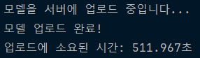
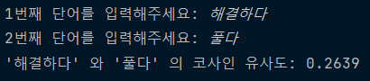
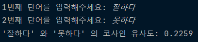

# Experiment_Kor-fastText
한국어 fastText를 fine tuning 시켜서 유사도를 높이거나, 경량화를 시켜보는 레포지토리입니다.  
아래의 링크에서 한국어 fastText를 받을 수 있습니다.  
https://fasttext.cc/docs/en/crawl-vectors.html
---

# 시작 계기
https://github.com/HwangRock/notion-serverless-voca  
위의 프로젝트를 하다가 워드 임베딩을 통한 유사도를 기반으로 한 영단어 채점으로 서비스의 질을 높여보기로 했습니다.  
단어 간 유사도만을 계산하면 되므로 Bert보다는 더 가벼운 fastText를 사용하기로 했습니다.  

---

# pre-trained Kor-fastText 실험 후기
./experiment_PreTrain/main.py의 코드로 실험을 했습니다.  
Bert보다 가볍다고 해서 KB단위를 기대했는데 7.2GB로 생각보다 무거웠습니다.  
그러다보니 서버에 올리는 것만해도 약 8이 걸려서 FaaS로 사용하려는 의도는 포기했습니다.  
  
 
pre-train된 모델이라 그런지 유사도 계산도 그렇게 정확하지는 못했습니다.  
유의어와 반의어를 각각 실험했는데 둘 다 유사도가 0.2로 비슷하게 나왔습니다.  
###### 유사어를 했을 때  
  
###### 반의어를 했을 때  
  

# How to improve?
2가지로 실험을 해볼 생각입니다.  
FaaS로 쓸 수 있을 정도는 아니더라도 경량화를 시켜서 성능이 비슷하고 나오게 하기.  
fine-tuning을 시켜서 더 높은 유사도를 나오게 하기.  
 
학습 데이터를 바꾸는 식으로 개선해볼 생각입니다.