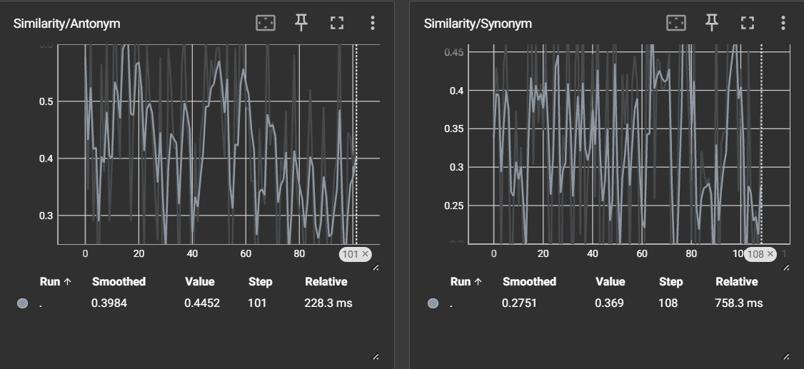
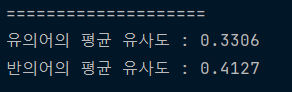

## Experiment_Kor-fastText  

한국어 fastText를 fine tuning 시켜서 유사도를 높이거나, 경량화를 시켜보는 레포지토리입니다.  
아래의 링크에서 한국어 fastText를 받을 수 있습니다.  
https://fasttext.cc/docs/en/crawl-vectors.html

---

## 시작 계기
https://github.com/HwangRock/notion-serverless-voca  
위의 프로젝트를 하다가 워드 임베딩을 통한 유사도를 기반으로 한 영단어 채점으로 서비스의 질을 높여보기로 했습니다.  
단어 간 유사도만을 계산하면 되므로 맥락을 보는 Bert보다는 더 가벼운 fastText를 사용하기로 했습니다.  

---

## pre-trained Kor-fastText 실험 후기
./experiment_PreTrain/main.py의 코드로 실험을 했습니다.  
 
Bert보다 가볍다고 해서 KB단위를 기대했는데 7.2GB로 생각보다 무거웠습니다.  
그러다보니 서버에 올리는 것만해도 약 8이 걸려서 FaaS로 사용하려는 의도는 포기했습니다.  
  
 
성능 확인을 위해 여러가지 단어로 테스트를 해봤습니다.  
그 중에서 유의어와 반의어를 했을 때 유의미한 결과를 확인했습니다.  
###### 유사어를 했을 때  
  
###### 반의어를 했을 때  
  
벡터를 다뤄서 유의어와 반의어가 큰 차이가 나는 것을 기대했는데 비슷한 결과가 나왔습니다.  
우연인지 필연인지 검증을 위해 유의어-반의어 평가를 진행했습니다.

---

## pre-trained Kor-fastText 평가 후기
./scripts/eval.py의 코드로 평가를 했습니다.  
 
네이버 네이버 Open Dictionary에서 유의어 반의어 크롤링을 통해 대략 100개의 데이터를 생성했습니다.  
평가 그래프는 아래와 같이 나왔습니다. tensorboardX로 시각화를 했습니다.  
  
 
최종 결과는 아래와 같이 나왔습니다.  
  
 
이로써 fastText는 단어가 얼마나 같이 쓰이는가로 벡터를 계산하고, 유의어-반의어와는 상관없다는 것을 확인했습니다.  

---

## 문제 정의
기존의 fastText는 "단어가 얼마나 같이 쓰이는가?"는 잘 잡지만, 유의어-반의어의 벡터는 할 수 없다는 것을 알았습니다.  
이 프로젝트에서는 워드 임베딩이 유의어-반의어까지 잡아낼 수 있는 방법론을 구할 것입니다.  
(나의 영단어장을 위해서..)  
